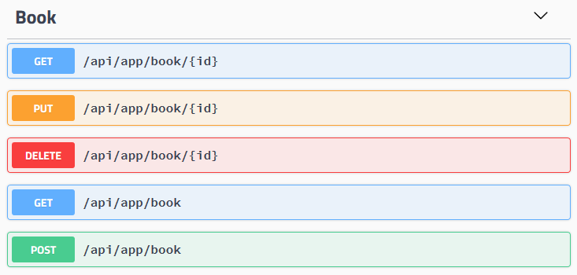

# 自动API控制器

创建[应用程序服务](Application-Services.md)后, 通常需要创建API控制器以将此服务公开为HTTP(REST)API端点. 典型的API控制器除了将方法调用重定向到应用程序服务并使用[HttpGet],[HttpPost],[Route]等属性配置REST API之外什么都不做.

ABP可以按照惯例 **自动** 将你的应用程序服务配置为MVC API控制器. 大多数时候你不关心它的详细配置,但它可以完全被自定义.

## 配置

基本配置很简单. 只需配置`AbpAspNetCoreMvcOptions`并使用`ConventionalControllers.Create`方法，如下所示：

````csharp
[DependsOn(BookStoreApplicationModule)]
public class BookStoreWebModule : AbpModule
{
    public override void ConfigureServices(ServiceConfigurationContext context)
    {
        Configure<AbpAspNetCoreMvcOptions>(options =>
        {
            options
                .ConventionalControllers
                .Create(typeof(BookStoreApplicationModule).Assembly);
        });
    }
}
````

此示例代码配置包含类`BookStoreApplicationModule`的程序集中的所有应用程序服务.下图显示了[Swagger UI](https://swagger.io/tools/swagger-ui/)上的API内容.



### 例子

一些示例方法名称和按约定生成的相应路由:

| 服务方法名称                                   | HTTP Method | 路由                      |
| ----------------------------------------------------- | ----------- | -------------------------- |
| GetAsync(Guid id)                                     | GET         | /api/app/book/{id}         |
| GetListAsync()                                        | GET         | /api/app/book              |
| CreateAsync(CreateBookDto input)                      | POST        | /api/app/book              |
| UpdateAsync(Guid id, UpdateBookDto input)             | PUT         | /api/app/book/{id}         |
| DeleteAsync(Guid id)                                  | DELETE      | /api/app/book/{id}         |
| GetEditorsAsync(Guid id)                              | GET         | /api/app/book/{id}/editors |
| CreateEditorAsync(Guid id, BookEditorCreateDto input) | POST        | /api/app/book/{id}/editor  |

### HTTP Method

ABP在确定服务方法的HTTP Method时使用命名约定:

- **Get**: 如果方法名称以`GetList`,`GetAll`或`Get`开头.
- **Put**: 如果方法名称以`Put`或`Update`开头.
- **Delete**: 如果方法名称以`Delete`或`Remove`开头.
- **Post**: 如果方法名称以`Create`,`Add`,`Insert`或`Post`开头.
- **Patch**: 如果方法名称以`Patch`开头.
- 其他情况, **Post** 为 **默认方式**.

如果需要为特定方法自定义HTTP Method, 则可以使用标准ASP.NET Core的属性([HttpPost], [HttpGet], [HttpPut]... 等等.). 这需要添加[Microsoft.AspNetCore.Mvc.Core](https://www.nuget.org/packages/Microsoft.AspNetCore.Mvc.Core)的Nuget包.

### 路由

路由根据一些惯例生成:

* 它始终以 **/api**开头.
* 接着是**路由路径**. 默认值为"**/app**", 可以进行如下配置:

````csharp
Configure<AbpAspNetCoreMvcOptions>(options =>
{
    options.ConventionalControllers
        .Create(typeof(BookStoreApplicationModule).Assembly, opts =>
            {
                opts.RootPath = "volosoft/book-store";
            });
});
````

然后获得一本书的路由将是'**/api/volosoft/book-store/book/{id}**'. 此示例使用两级根路径,但通常使用单个级别的深度.

* 接着 **标准化控制器/服务名称**. 会删除`AppService`,`ApplicationService`和`Service`的后缀并将其转换为 **camelCase**. 如果你的应用程序服务类名称为`BookAppService`.那么它将变为`/book`.
  * 如果要自定义命名, 则设置`UrlControllerNameNormalizer`选项. 它是一个委托允许你自定义每个控制器/服务的名称.
* 如果该方法具有 '**id**'参数, 则会在路由中添加'**/{id}**'.
* 如有必要,它会添加操作名称. 操作名称从服务上的方法名称获取并标准化;
  * 删除'**Async**'后缀. 如果方法名称为'GetPhonesAsync',则变为`GetPhones`.
  * 删除**HTTP method前缀**. 基于的HTTP method删除`GetList`,`GetAll`,`Get`,`Put`,`Update`,`Delete`,`Remove`,`Create`,`Add`,`Insert`,`Post`和`Patch`前缀, 因此`GetPhones`变为`Phones`, 因为`Get`前缀和GET请求重复.
  * 将结果转换为**camelCase**.
  * 如果生成的操作名称为**空**,则它不会添加到路径中.否则它会被添加到路由中(例如'/phones').对于`GetAllAsync`方法名称，它将为空,因为`GetPhonesAsync`方法名称将为`phone`.
  * 可以通过设置`UrlActionNameNormalizer`选项来自定义.It's an action delegate that is called for every method.
* 如果有另一个带有'Id'后缀的参数,那么它也会作为最终路线段添加到路线中(例如'/phoneId').

## 服务选择

创建的HTTP API控制器并不是应用服务所独有的功能.

### IRemoteService 接口

如果一个类实现了`IRemoteService`接口, 那么它会被自动选择为API控制器. 由于应用程序服务本身实现了`IRemoteService`接口, 因此它自然就成为API控制器.

### RemoteService Attribute

`RemoteService`可用于将实现`IRemoteService`接口的类标记为远程服务或禁用它. 例如:

````csharp
[RemoteService(IsEnabled = false)] //or simply [RemoteService(false)]
public class PersonAppService : ApplicationService
{

}
````

### TypePredicate 选项

你可以通过提供`TypePedicate`选项进一步过滤类以成为API控制器:

````csharp
services.Configure<AbpAspNetCoreMvcOptions>(options =>
{
    options.ConventionalControllers
        .Create(typeof(BookStoreApplicationModule).Assembly, opts =>
            {
                opts.TypePredicate = type => { return true; };
            });
});
````

如果你不想将此类型公开为API控制器, 则可以在类型检查时返回`false`.

## API Explorer

API Explorer是可以由客户端获取API结构的服务. Swagger使用它为endpoint创建文档和test UI.

默认情况下, HTTP API控制器会自动启用API Explorer, 可以使用`RemoteService`按类或方法的级别控制它. 例如:

````csharp
[RemoteService(IsMetadataEnabled = false)]
public class PersonAppService : ApplicationService
{

}
````

禁用`IsMetadataEnabled`从而从API Explorer中隐藏此服务, 并且无法被发现. 但是它仍然可以被知道确切API路径/路由的客户端使用.